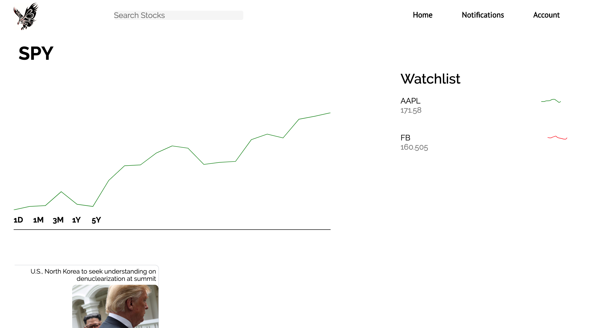
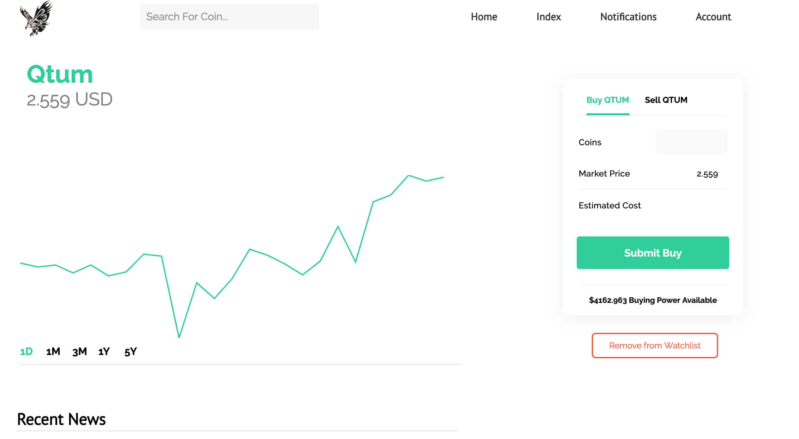
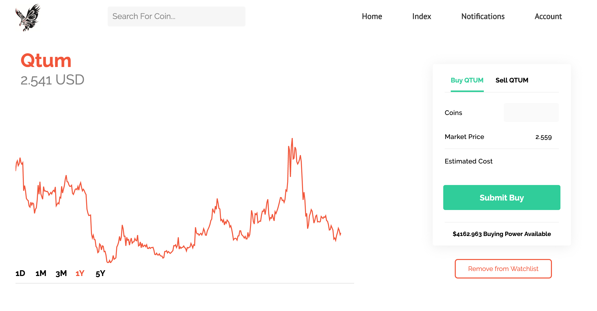
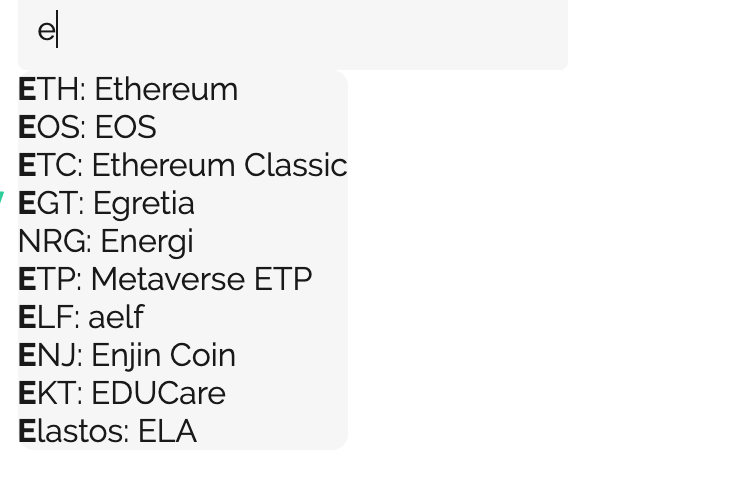
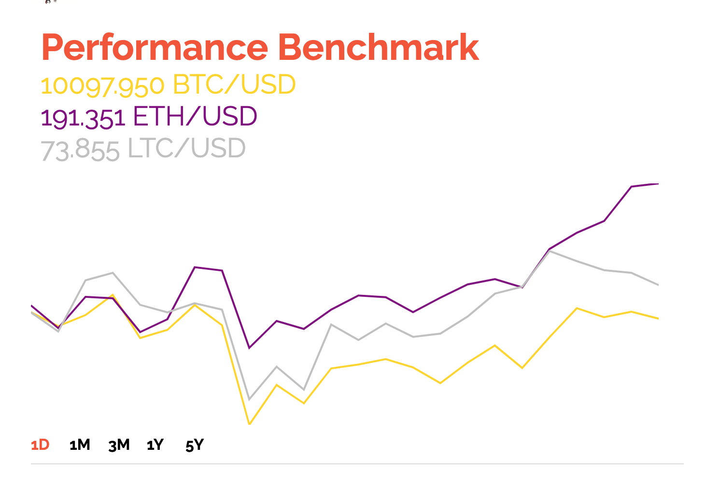
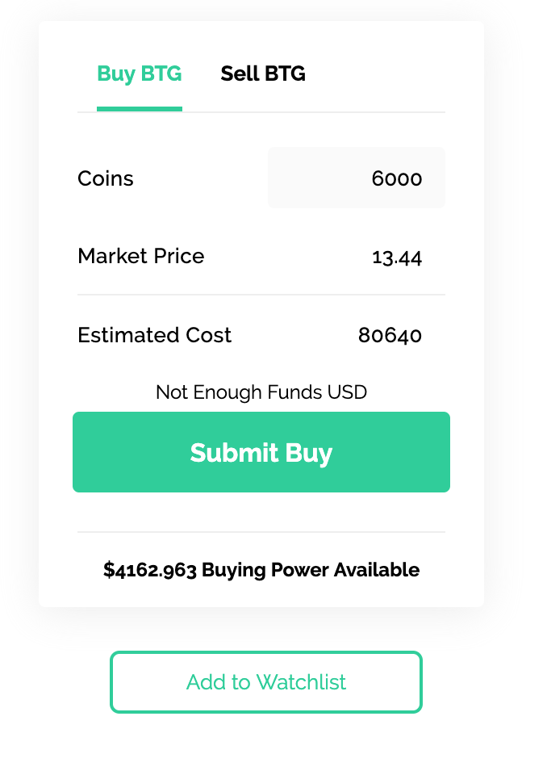
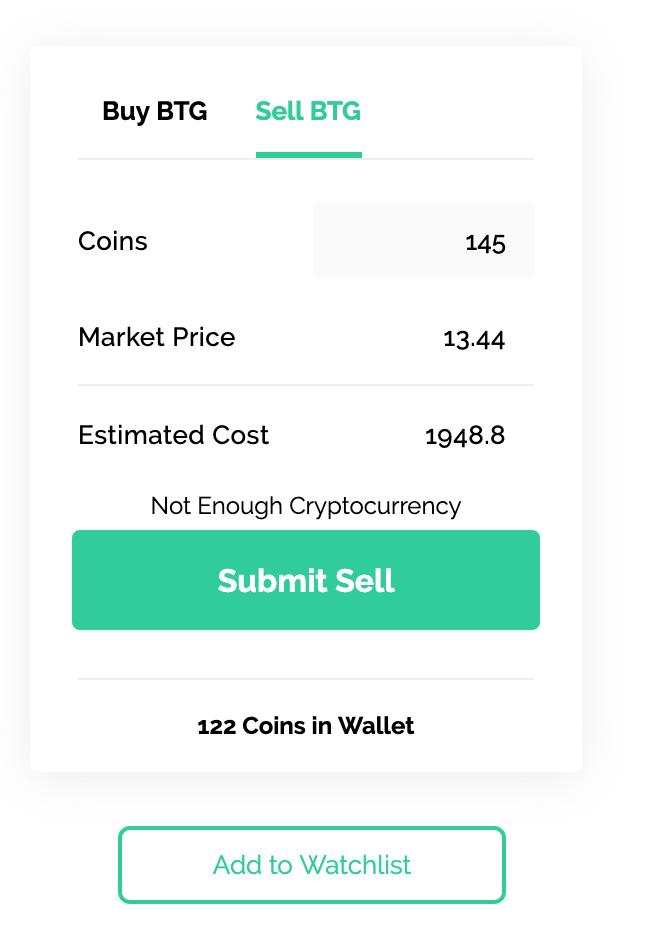

# README

## MonteCrypto
[Live Link](https://montecrypto.herokuapp.com)

## Technologies
 * Frontend - **React/Redux**
 * Backend - **Ruby on Rails**, **PostreSQL**
 * [Cryptocompare](https://cryptocompare.com) - To query real-time stock data
 * [Recharts](http://recharts.org/en-US) - To interactively visualize stock price fluctuation for relevant stock

 ## Features
 * Secure user authentication using *Bcrypt*
 * Transaction system that ensures buying power / coin ownership
 * News Index that provides the latest currency news
 * Watchlists allow users to keep track of coins
 * Sidebar lists all coins in portfolio and watchlist

## About
 Single-page Cryptocurrency tracking and investment app inspired by online brokerage and trading site Robinhood

## Curated News

Real time news for each currency, displayed with time or date of release dynamically updated. If within 24 hours displayed in hours, if within 1 hour displayed in minutes, otherwise displayed as a date.

## Coins page

Coins page charts change color between green and red depending on trend of coin. If downward trend, red is the theme, if upward, green. Each coin has coin specific news for accurate diagnosis of investment before purchase. Price on chart is update every 5 seconds.

## Searchbar

Search bar from application backend for quick symbol lookup. Upon click, new data is fetched from Cryptocompare API. Search results are highlighted based on input for easy to visualize query.

## Performance

Top currencies are displayed in one chart for performance visualization of alternate coins alongside bitcoin. Upon hover, percentage change is calculated based on time period.

## Transactions
Simple to use transactions bar, that automatically removes sell button if one currently has no coins in wallet. Displays current number of coins in wallet when on sell tab, and buying power when on buy tab. Updates all figures upon buy or sell and displays errors if not enough coins to sell, or not enough funds for any lofty purchase.

